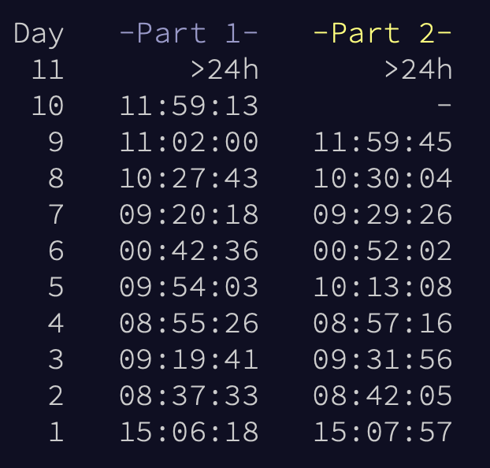

# Advent of Code 2025

Good day, everyone. This repository contains my solutions to puzzles from [Advent of Code 2025](https://adventofcode.com).

My language of choice this time around is [Zig](https://ziglang.org). I didn't learn Zig beforehand, so you will notice me doing very silly things, especially on the earlier puzzles.

There should be exactly two solutions for each day — the first part and the second part. However, I sometimes forget to save the code for the first part and overwrite it.

I do not care about my solving times. I do, however, care about consistency and I am aiming for all 24 stars. Best of luck to me and to everyone else who is participating!

## Final result and conclusion

In the end I managed to grab **21 out of 24** possible stars. I couldn't solve the second part of Day 10 and I have no clue about Day 12 at all.

Overall, it was very enjoyable. I learned a lot about Zig and had a ton of fun implementing things. Especially implementing a _disjoint set-union_ data structure on Day 8 was super cool! I think I will stick to Zig for a while longer and try to use it on some new pet projects.

Big thanks to the organizers of Advent of Code! I would love to participate again next year. Perhaps I will try some other language! (Looking at you, [Gleam](https://gleam.run) 👀)
